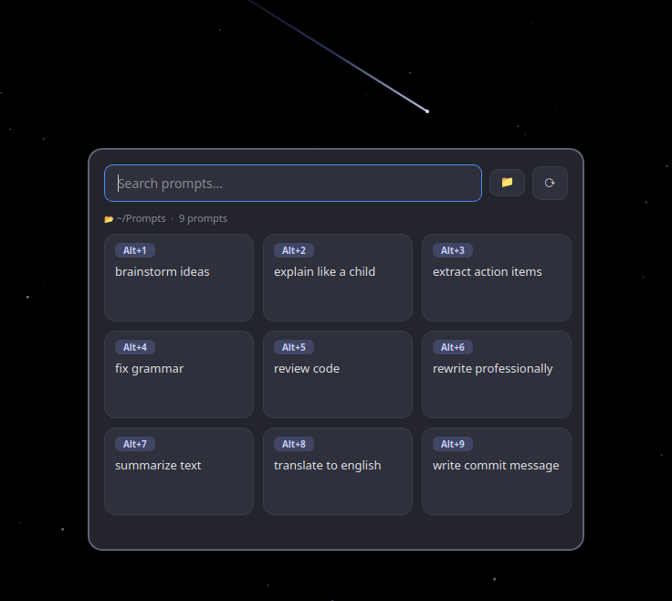
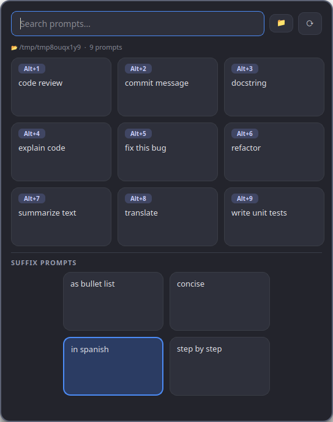

# Prompt Library

[](https://github.com/federico-duppa/prompt-library/actions/workflows/ci.yml)
[](https://www.python.org/)
[](LICENSE)
[](https://doc.qt.io/qtforpython/)

A keyboard-first **prompt launcher** for Ubuntu (GNOME / Wayland). It lives in the **system
tray**, and a global hotkey pops a focused, full-screen "command palette": pick a saved prompt
and it's on your clipboard in one click — or one `Alt+<number>`. Built for the copy-paste loop
of working with LLMs.

<p align="center">
  
</p>

## What it does

- Scans a folder (flat, non-recursive) looking for `*.prompt` files.
- Shows each prompt by its name (`summarize text.prompt` → **summarize text**)
  as **cards in a compact, auto-sized grid** (up to a 5×5 of 25 prompts, no scrolling).
- **Click** a card → copies its content to the clipboard.
- **Alt+1 … Alt+9** → copy the first nine visible cards (the badge shows it on each one).
- After copying, the window hides to the tray a few ms later.
- Remembers the last folder used; on first launch it offers to pick one.
- **Global hotkey `Super+Shift+P`** to show the window from anywhere.
- Search box with renumbering of the `Alt+N` shortcuts over the filtered results.
- **Suffix prompts for composition:** prompts named `Suffix*.prompt` appear in a
  separate section. Selecting one (it just highlights — sticky across opens, click
  again to clear) appends its text to whatever main prompt you copy next, so you can
  pin a reusable modifier like "translate to Spanish" onto any prompt.

## Interface

- **Animated night-sky scrim:** the window covers the whole screen with a black backdrop
  that comes alive — a softly twinkling starfield with the occasional **shooting star**
  streaking past — focusing attention on the centered dialog (which has a border and a
  shadow). The animation only runs while the overlay is visible, then stops. (A see-through
  scrim isn't possible on GNOME Wayland — a fullscreen surface has no desktop behind it —
  so this turns that constraint into a feature.)
- **Closing:** `Esc` or **click on the dark area** (outside the dialog). It also hides when it
  loses focus. Clicks inside the dialog do not close it.
- **Compact adaptive grid:** the dialog sizes itself to a compact rectangle — up to **25 prompts (5×5)** without scrolling. Fewer prompts use the smallest vertical rectangle (a square for 4, 9, 16, 25). With more than 25 matches, the first 25 are shown and you narrow them with the search box.
- **Adjustable appearance** from the constants at the top of `prompt_library/app.py`:
  `CARD_WIDTH`, `CARD_HEIGHT`, `MAX_COLS`, `MIN_DIALOG_WIDTH`, and the scrim animation
  (`SCRIM_FPS`, `STAR_COUNT`, `METEOR_MAX`, `METEOR_SPAWN_CHANCE`, `STAR_COLOR`, `METEOR_COLOR`).

## Composing with suffix prompts

Any prompt whose filename starts with **`Suffix`** (e.g. `Suffix in spanish.prompt`)
is shown in a separate **Suffix prompts** section below the main grid, with the
`Suffix` prefix dropped from its label. These are reusable *modifiers* you pin onto
your prompts instead of copying them on their own.

<p align="center">
  
</p>

How it works:

1. **Click a suffix card to select it** — it just highlights (it does *not* copy or
   close). Click it again to deselect.
2. **Copy any main prompt** (click or `Alt+N`). The clipboard gets the main prompt,
   a blank line, then the selected suffix's text — so you can append "translate to
   Spanish", "be concise", etc. to whatever you copy.
3. **The selection is sticky:** it stays selected the next time you open the selector,
   until you click it again to clear it.

For example, with **`Suffix in spanish`** selected, copying **`explain code`** puts both
on the clipboard: the body of `explain code`, then the body of `Suffix in spanish`.

## Why `Super+Shift+P` and not `Super+P`

`Super+P` is reserved by GNOME (display mode) and, on top of that, on **Wayland** no app
can capture global hotkeys on its own. The robust solution is to register a custom GNOME
hotkey (via `gsettings`) that launches the app; the app uses **single instance**, so the
second invocation simply wakes the already-open window. It works on X11 and Wayland.

You can choose another combination at install time.

## Installation

### Recommended: full GNOME integration

```bash
./install.sh                 # venv + app + icon + menu + autostart + Super+Shift+P hotkey
# or with another combination:
./install.sh '<Control><Alt>p'
```

`install.sh` sets up:
- the app in the applications menu,
- autostart at login (starts hidden in the tray, `--tray`),
- the global hotkey registered.

### Debian package (`.deb`)

For handing the app to other desktops, build a self-contained `.deb` that bundles
its own PySide6/Qt — it installs and runs on any reasonably recent Debian/Ubuntu
desktop regardless of whether the distro packages PySide6:

```bash
packaging/build-deb.sh            # -> dist/prompt-library_<version>_amd64.deb
PRUNE=1 packaging/build-deb.sh    # smaller: drops Qt modules the app never uses
```

Build it on a Debian/Ubuntu host (ideally the oldest release you want to support,
e.g. Ubuntu 22.04, so the dependency names resolve everywhere); it needs internet
to fetch the PySide6 wheel and produces an `amd64` package (arm64 = a separate
build on an arm64 host). Then on the target machine:

```bash
sudo apt install ./prompt-library_<version>_amd64.deb   # resolves dependencies
```

This installs the app under `/opt/prompt-library`, a `/usr/bin/prompt-library`
launcher, a menu entry, **system-wide autostart** (`/etc/xdg/autostart`, applies
to every user), and the icon. The global hotkey can't be set at install time
(it's per-user gsettings), so the app registers `Super+Shift+P` itself the first
time each user opens it — re-run `prompt-library-hotkey '<binding>'` to change it.

### Just the command (pip / pipx)

The project is a regular Python package with a `prompt-library` console entry point:

```bash
pipx install .          # isolated install, exposes the `prompt-library` command
# or, in a virtualenv:
pip install .
prompt-library          # run it
```

This gives you the app and the tray; wire up a hotkey yourself with `./setup-hotkey.sh`.

### Hotkey only (if you already have the venv)

```bash
./setup-hotkey.sh                 # <Super><Shift>p
./setup-hotkey.sh '<Control><Alt>p'
./setup-hotkey.sh --remove        # remove it
```

## Manual usage

```bash
./prompt-library            # opens the window
./prompt-library --show     # opens/wakes (what the global hotkey invokes)
./prompt-library --tray     # starts hidden in the tray (what autostart uses)
```

- **Left click on the tray icon**: toggles show/hide.
- **Icon menu**: Show · Choose folder · Reload · Quit.
- Inside the dialog: `Ctrl+F` search, `Ctrl+R` reload, `Alt+1..9` copy.
- To close: `Esc` or click on the dark background area.

## Structure

```
prompt_library/        Python package (app.py, __main__.py, config.py, hotkey.py)
prompt-library         launcher (uses the venv's python by absolute path)
install.sh             full installation
setup-hotkey.sh        registers/removes the GNOME global hotkey
packaging/build-deb.sh builds a self-contained .deb (bundles PySide6/Qt)
examples/              example prompts
assets/                screenshots
pyproject.toml         single source of truth: deps, dev extra, entry point, tooling
```

Config in `~/.config/prompt-library/config.json` (`directory`, `hide_delay_ms`).

## Requirements

- Python 3.10+
- GNOME (the tray icon needs the AppIndicator/StatusNotifier extension,
  which Ubuntu ships enabled by default).

## Development

```bash
.venv/bin/python -m pip install -e ".[dev]"   # app + pytest, pytest-qt, ruff
.venv/bin/python -m pytest        # tests (headless, Qt offscreen)
.venv/bin/ruff check .            # lint
```

## License

Licensed under the [Apache License, Version 2.0](LICENSE).
